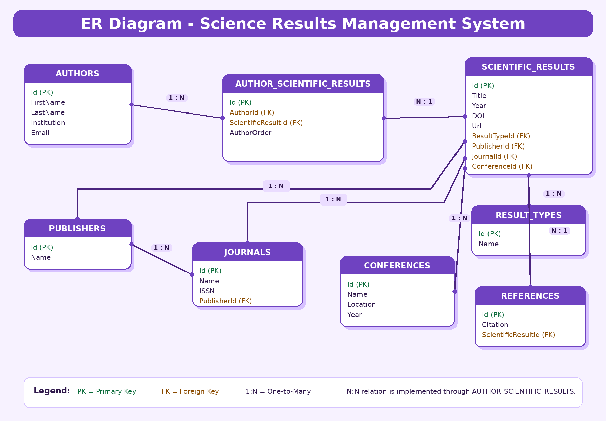

## Project Assignment

The goal of this project is to develop a web application for managing a database of scientific results. The system should support different categories of scientific outputs, including:

* Journal articles
* Conference papers (published in conference proceedings)
* Scientific monographs
* Book chapters
* Patents
* Technical solutions
* Datasets
* Software
* AI models
* Other scientific and research outputs

The application should provide the following functionalities:

* Management of authors of scientific results
* Management of all types of scientific results
* Establishing relationships between scientific results and their authors, references, and related entities
* Search, filtering, and presentation of scientific results according to different criteria
* Storage and management of research-related metadata

The database must contain a minimum of eight relational tables and include both:

* One-to-Many relationships
* Many-to-Many relationships

The project was implemented using ASP.NET Core, Razor Pages, Entity Framework Core, and SQLite.

---

### Assignment Author

**Project assignment defined by:**

Prof. Dr. Velibor Isailović

Faculty of Engineering Sciences
University of Kragujevac

Software Engineering 2 Course


# Science Results Management System

Science Results Management System is a web application developed for the course **Software Engineering 2**.
The purpose of the application is to manage a database of scientific results, including journal papers, conference papers, monographs, book chapters, patents, technical solutions, datasets, software solutions, AI models, authors, publishers, journals, conferences and references.

The system was implemented using **ASP.NET Core**, **Razor Pages**, **Web API**, **Entity Framework Core**, and **SQLite**.

---

## Project Topic

The application enables management of scientific research outputs and supports:

* recording authors of scientific results,
* recording different types of scientific results,
* connecting scientific results with authors,
* connecting scientific results with references, publishers, journals and conferences,
* viewing and searching stored data,
* managing data through a web interface and API endpoints.

The database contains more than 8 relational tables and includes both **one-to-many** and **many-to-many** relationships.

---

## Technologies Used

### Backend

* ASP.NET Core Web API
* Entity Framework Core
* SQLite
* Swagger / OpenAPI
* C#
* .NET 9

### Frontend

* ASP.NET Core Razor Pages
* Bootstrap
* HTML
* CSS
* Razor syntax
* HttpClient for communication with the backend API

### Database

* SQLite
* Entity Framework Core migrations
* Seed data for initial testing

---

## Solution Structure

The project consists of two applications:

```text
ScienceResultsProject
│
├── ScienceResultsApi
│   ├── Controllers
│   ├── Data
│   ├── Entities
│   ├── Migrations
│   ├── Program.cs
│   ├── appsettings.json
│   └── ScienceResultsApi.csproj
│
└── ScienceResultsWeb
    ├── Pages
    ├── wwwroot
    ├── Program.cs
    └── ScienceResultsWeb.csproj
```

---

## Backend Project: ScienceResultsApi

The backend project is responsible for:

* database access,
* entity relationships,
* CRUD operations,
* API endpoints,
* Swagger documentation,
* database seeding.

The backend runs on:

```text
http://localhost:5123
```

Swagger is available at:

```text
http://localhost:5123/swagger
```

---

## Frontend Project: ScienceResultsWeb

The frontend project is a Razor Pages web application.

It communicates with the backend API using `HttpClient`.

The frontend includes:

* dashboard page,
* authors page,
* result types page,
* scientific results page,
* publishers page,
* forms for adding new data,
* tables for displaying data,
* search functionality,
* custom purple user interface theme.

The frontend runs on:

```text
http://localhost:5177
```

---

## Database Tables

The application uses the following main tables:

1. Authors
2. ScientificResults
3. ResultTypes
4. Publishers
5. Journals
6. Conferences
7. References
8. AuthorScientificResults

Additional related data is managed through relationships between these entities.

---

## Entity Description

### Authors

Stores information about authors of scientific results.

Main fields:

* Id
* FirstName
* LastName
* Institution
* Email

---

### ScientificResults

Stores information about scientific outputs.

Main fields:

* Id
* Title
* Year
* DOI
* Url
* ResultTypeId
* PublisherId
* JournalId
* ConferenceId

---

### ResultTypes

Stores different types of scientific results.

Examples:

* Journal Article
* Conference Paper
* Book Chapter
* Dataset
* Software
* AI Model
* Patent
* Technical Solution

---

### Publishers

Stores publisher information.

Main fields:

* Id
* Name

---

### Journals

Stores journal information.

Main fields:

* Id
* Name
* ISSN
* PublisherId

---

### Conferences

Stores conference information.

Main fields:

* Id
* Name
* Location
* Year

---

### References

Stores references connected to scientific results.

Main fields:

* Id
* Citation
* ScientificResultId

---

### AuthorScientificResults

This is a junction table used to implement a many-to-many relationship between authors and scientific results.

Main fields:

* Id
* AuthorId
* ScientificResultId
* AuthorOrder

---

## Database Relationships

### One-to-Many Relationships

The system includes several one-to-many relationships:

```text
ResultType → ScientificResults
Publisher → Journals
Publisher → ScientificResults
Conference → ScientificResults
Journal → ScientificResults
ScientificResult → References
```

Example:

One result type can be connected to many scientific results.

---

### Many-to-Many Relationship

The main many-to-many relationship is:

```text
Authors ↔ ScientificResults
```

This is implemented using the junction table:

```text
AuthorScientificResults
```

This allows one author to have many scientific results and one scientific result to have multiple authors.

---

## Main Functionalities

The application supports:

* viewing dashboard statistics,
* viewing all authors,
* adding new authors,
* viewing all result types,
* adding new result types,
* viewing scientific results,
* adding new scientific results,
* searching scientific results by title, DOI or year,
* viewing publishers,
* adding publishers,
* testing API endpoints using Swagger.

---

## Dashboard

The dashboard displays:

* number of authors,
* number of result types,
* number of scientific results,
* number of publishers,
* quick search field,
* latest scientific results.

The dashboard uses a custom purple theme and Bootstrap cards for a modern look.

---

## Search Functionality

The frontend contains a search feature for scientific results.

Users can search by:

* title,
* DOI,
* year.

This satisfies the project requirement for searching and filtering data by different criteria.

---

## API Endpoints

Some of the main API endpoints are:

### Authors

```text
GET    /api/Authors
GET    /api/Authors/{id}
POST   /api/Authors
PUT    /api/Authors/{id}
DELETE /api/Authors/{id}
```

### Result Types

```text
GET    /api/ResultTypes
GET    /api/ResultTypes/{id}
POST   /api/ResultTypes
PUT    /api/ResultTypes/{id}
DELETE /api/ResultTypes/{id}
```

### Scientific Results

```text
GET    /api/ScientificResults
GET    /api/ScientificResults/{id}
POST   /api/ScientificResults
PUT    /api/ScientificResults/{id}
DELETE /api/ScientificResults/{id}
```

### Publishers

```text
GET    /api/Publishers
POST   /api/Publishers
```

---

## How to Run the Project

The solution contains two separate projects:

* `ScienceResultsApi`
* `ScienceResultsWeb`

Both must be running at the same time.

---

## Step 1: Run the Backend API

Open the first terminal and run:

```powershell
cd C:\Users\Hp\ScienceResultsProject\ScienceResultsApi
dotnet restore
dotnet build
dotnet ef database update
dotnet run
```

The backend should start on:

```text
http://localhost:5123
```

Swagger can be opened at:

```text
http://localhost:5123/swagger
```

---

## Step 2: Run the Frontend Application

Open the second terminal and run:

```powershell
cd C:\Users\Hp\ScienceResultsProject\ScienceResultsWeb
dotnet restore
dotnet build
dotnet run
```

The frontend should start on:

```text
http://localhost:5177
```

Open the application in browser:

```text
http://localhost:5177
```

---

## Important Note

The backend must be running before using the frontend, because the Razor Pages application communicates with the backend through API requests.

If the backend is not running, the frontend pages will not be able to load data.

---

## How to Test the Application

### Using Swagger

Open:

```text
http://localhost:5123/swagger
```

Test endpoints such as:

* `GET /api/Authors`
* `POST /api/Authors`
* `GET /api/ScientificResults`
* `POST /api/ScientificResults`
* `GET /api/ResultTypes`
* `POST /api/ResultTypes`

### Using Frontend

Open:

```text
http://localhost:5177
```

Then use the navigation links:

* Authors
* Result Types
* Scientific Results
* Publishers

---

## Example Test Data

The application includes seed data such as:

* several authors,
* several result types,
* publishers,
* conferences,
* scientific results,
* references,
* author-result connections.

This makes the project easier to test immediately after running.

---

## Example Scientific Result

```json
{
  "title": "Neural Networks in Control Systems",
  "year": 2025,
  "doi": "10.1234/nncs.2025",
  "url": "https://example.com/nncs",
  "resultTypeId": 1
}
```

---

## Project Requirements Coverage

| Requirement                 | Implemented |
| --------------------------- | ----------- |
| Web application             | Yes         |
| SQLite database             | Yes         |
| Entity Framework Core ORM   | Yes         |
| Minimum 8 tables            | Yes         |
| One-to-many relationships   | Yes         |
| Many-to-many relationships  | Yes         |
| Authors evidence            | Yes         |
| Scientific results evidence | Yes         |
| Result types evidence       | Yes         |
| References                  | Yes         |
| Search functionality        | Yes         |
| Data views                  | Yes         |
| Swagger testing             | Yes         |
| Frontend interface          | Yes         |

---

## How the Application Works

The system is divided into two layers:

1. Backend API
   Handles database operations, entities, relationships, migrations and CRUD endpoints.

2. Frontend Razor Pages
   Displays data to the user and sends requests to the backend API.

The frontend does not access the database directly. Instead, it communicates with the API using HTTP requests.

---

## Conclusion

This project represents a complete scientific results management system. It demonstrates the use of ASP.NET Core, Razor Pages, Web API, Entity Framework Core, SQLite, relational database design, CRUD operations, many-to-many relationships, one-to-many relationships, data search and a styled user interface.

The application can be expanded further by adding authentication, advanced filtering, export to PDF/Excel, user roles and detailed reporting.


## Entity Relationship Diagram (ER Diagram)

The following diagram illustrates the database structure and relationships between entities used in the application.

The database contains:

- One-to-Many relationships
- Many-to-Many relationships
- Junction table (AuthorScientificResults)
- Support for authors, scientific results, publishers, journals, conferences, references, and result types


